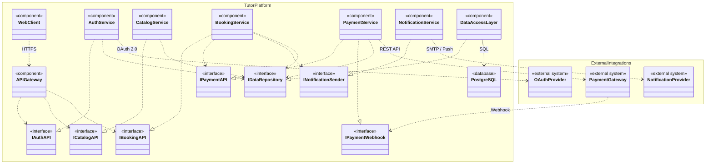

```mermaid
classDiagram
    direction TB

    namespace TutorPlatform {
        class WebClient {
            <<component>>
        }
        class APIGateway {
            <<component>>
        }

        class IAuthAPI {
            <<interface>>
        }
        class ICatalogAPI {
            <<interface>>
        }
        class IBookingAPI {
            <<interface>>
        }
        class IPaymentAPI {
            <<interface>>
        }
        class IPaymentWebhook {
            <<interface>>
        }
        class INotificationSender {
            <<interface>>
        }
        class IDataRepository {
            <<interface>>
        }

        class AuthService {
            <<component>>
        }
        class CatalogService {
            <<component>>
        }
        class BookingService {
            <<component>>
        }
        class PaymentService {
            <<component>>
        }
        class NotificationService {
            <<component>>
        }
        class DataAccessLayer {
            <<component>>
        }
        class PostgreSQL {
            <<database>>
        }
    }

    namespace ExternalIntegrations {
        class OAuthProvider {
            <<external system>>
        }
        class PaymentGateway {
            <<external system>>
        }
        class NotificationProvider {
            <<external system>>
        }
    }

    %% Provided interfaces (реалізація)
    AuthService ..|> IAuthAPI
    CatalogService ..|> ICatalogAPI
    BookingService ..|> IBookingAPI
    PaymentService ..|> IPaymentAPI
    PaymentService ..|> IPaymentWebhook
    NotificationService ..|> INotificationSender
    DataAccessLayer ..|> IDataRepository

    %% Required interfaces (залежності)
    WebClient ..> APIGateway : HTTPS
    APIGateway ..> IAuthAPI
    APIGateway ..> ICatalogAPI
    APIGateway ..> IBookingAPI

    BookingService ..> IPaymentAPI
    BookingService ..> INotificationSender

    AuthService ..> IDataRepository
    CatalogService ..> IDataRepository
    BookingService ..> IDataRepository
    PaymentService ..> IDataRepository

    DataAccessLayer --> PostgreSQL : SQL

    %% Зовнішні інтеграції
    AuthService ..> OAuthProvider : OAuth 2.0
    PaymentService ..> PaymentGateway : REST API
    PaymentGateway ..> IPaymentWebhook : Webhook
    NotificationService ..> NotificationProvider : SMTP / Push
```
